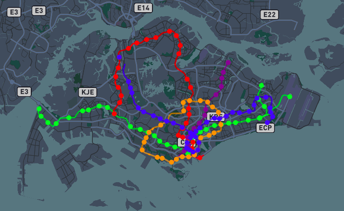
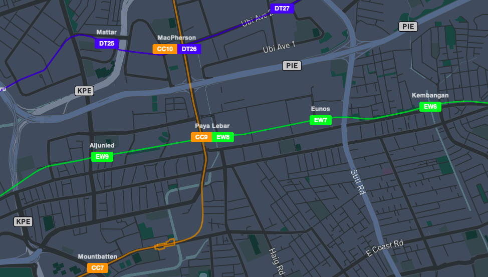

# [MRT Map](https://themindstorm.github.io/mrt/)
> Map of all MRT lines in Singapore

## Images

## Built with
- Mapbox
- OpenStreetMap
- ParcelJS
- Python

The code can be used to map out any metro/railway line as long as the data is on OpenStreetMap. Singapore's MRT data can be found [here](https://wiki.openstreetmap.org/wiki/Mass_Rapid_Transit_(Singapore)).

The file `global_vars.py' can be edited, and any railway relation from OpenStreetMap can be added.